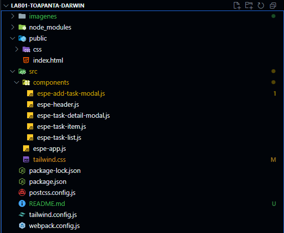

# 🚀 ESPE Tasks App

¡Bienvenido a la aplicación **ESPE Tasks**, un gestor de tareas moderno y responsivo construido con LitElement y Tailwind CSS

Este proyecto es un ejemplo de cómo construir componentes web reutilizables y con un diseño llamativo.

<p align="center">
  
</p>
---

## 🌟 Características

- **Gestión de Tareas:** Organiza tus tareas por fecha y prioridad.
- **Componentes Web Reutilizables:** Desarrollado con LitElement.
- **Estilizado con Tailwind CSS:** Para un diseño rápido y consistente.
- **Diseño Responsivo:** Se adapta a diferentes tamaños de pantalla.
- **Modal para Añadir/Editar Tareas:** Interfaz para la gestión de detalles de tareas.

---

## 🛠️ Tecnologías Utilizadas

- **[LitElement](https://lit.dev/):** Una librería simple, rápida y ligera para construir componentes web.
- **[Tailwind CSS](https://tailwindcss.com/):** Un framework CSS "utility-first" para construir diseños personalizados rápidamente.
- **[Webpack](https://webpack.js.org/):** Empaquetador de módulos para la aplicación JavaScript.
- **[npm](https://www.npmjs.com/):** Gestor de paquetes.

---

## 🚀 Cómo Empezar

### ✅ Pre-requisitos

Asegúrate de tener instalado en tu sistema:

- [Node.js](https://nodejs.org/) (se recomienda la versión LTS)
- [npm](https://www.npmjs.com/) (viene incluido con Node.js)

### 📦 Instalación

1. **Clona el repositorio:**

   ```bash
   git clone https://github.com/DarwinToapanta01/lab01-parcial2.git
   cd lab01-parcial2

2. **Instala las dependencias:**
    ```bash
    npm install
### 📂 Estructura del Proyecto
En esta imagen podemos ver la estructura del proyecto:

<p align="center">
  
</p>